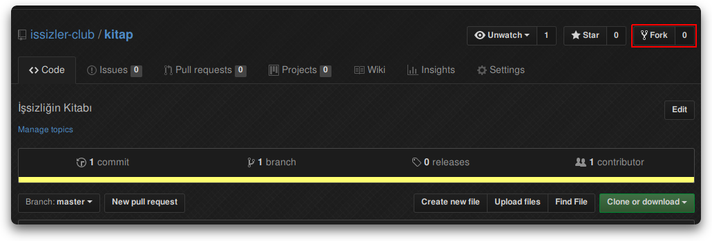
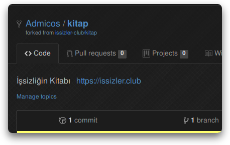
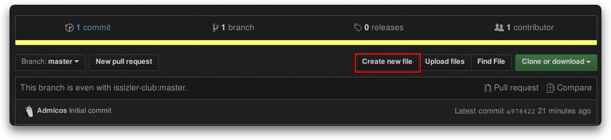
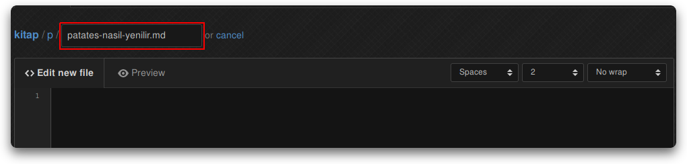
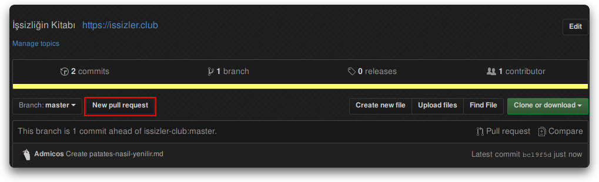
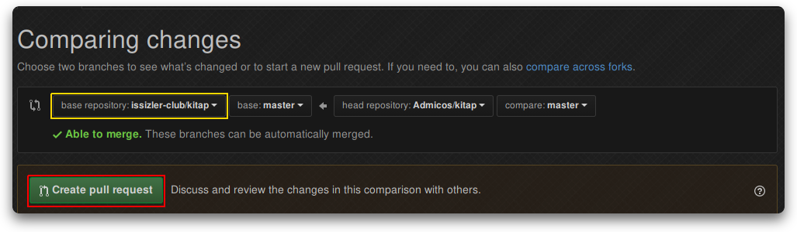
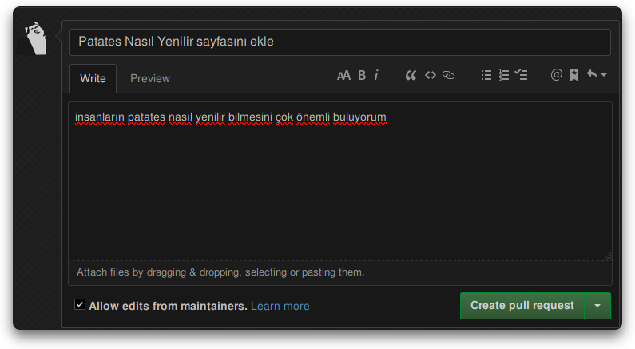

# İşsizliğin Kitabına Nasıl Yazılır

İşsizliğin Kitabı'na yazabilmek için, bir GitHub hesabınızın olması gerekmektedir.
Yoksa şimdiden yaratmanız önerilir.

## İşsizliğin Kitabı Neleri Kabul Eder

İşsizliğin Kitabı'na, herhangi bir yerde kullanışlı olabilecek her rehber kabul
edilir.

## Kolay Yoldan Yazmak

::: warning DIKKAT
Kalem sistemi hala **BETA** aşamasındadır. GitHub hala tavsiye edilen sayfa
gönderme yoludur.
:::

[Kalem](https://issizler.club/yaz) sistemini kullanarak kolay yoldan kitaba
sayfalarınızı gönderebilirsiniz. Bu sayfanın gerisi GitHub üzerinden sayfa
göndermeyi öğretmektedir.

Tavsiye edilen yol GitHub üzerinden sayfa göndermektir. Kalem sistemi
üzerinden yazılan sayfalara geri bildirim gönderemediğimiz için, sayfanızın
onaylanmasını isterseniz GitHub üzerinden yazmanız önerilir.

## Kitabı Kendinize Kopyalamak

GitHub hesabınızı açtıktan sonra, yukarıdaki "Sen de yaz" adresine girin,
ve sağ üstteki "Fork" tuşuna basın.

Fork dedikten sonra, ve işlemin bitmesini bekledikten sonra, karşınızda size
özel bir İşsizliğin Kitabı kopyası göreceksiniz.

Bu kopyayı artık istediğiniz gibi düzenleyebilirsiniz.

::: tip NOT
Bir kere kendi kopyanızı yarattığınız zaman, aynı kopya üzerine istediğiniz
kadar sayfa yaratabilirsiniz
:::

## Yeni Bir Sayfa Eklemek

Yeni bir sayfa eklemek için, "Create new file" (Yeni dosya oluştur) tuşuna basmanız gerekmektedir.

Yeni sayfamızın ismi "Patates nasıl yenilir?" olacak diyelim, dosyanın adını
`p/patates-nasil-yenilir.md` yapmanız gerekmektedir.

::: tip NOT
Klasör adını, `p` yerine, sayfa adının ilk harfi yapmanız gerekmektedir.
:::

Ve aşağıdaki kısma, [Markdown](../m/markdown.md) dahilinde istediğinizi yazabilirsiniz.

::: tip NOT
Yukarıdaki "Preview" tuşu ile, yazdığınız Markdown kodunun önizlemesini alabilirsiniz.
:::

İstediğinizi yazdıktan sonra, en alta inip yeşil tuş ile kendi kopyanıza kayıt
edebilirsiniz.

## Sayfanızı Orijinal Kitaba Göndermek

Yazdığınız sayfaların [issizler.club](https://issizler.club) üzerinde görünebilmesini
istiyorsanız, orijinal kitaba geri göndermeniz gerekmektedir.

Bunu yapmak için, kendi kopyanızın ana sayfasına gelin, ve `New pull request`
tuşuna basın.

Burada, "base repository" kısmının `issizler-club/kitap` olduğuna emin olduktan
sonra, yeşil tuşa basarak bir pull request (çekme isteği) oluşturma alanına
devam edebilirsiniz.

Burada, başlık olarak, "XYZ sayfasını ekle" tarzı bir şey, açıklamaya da sayfa
hakkında bir açıklama girin, ve yeşil tuşa basarak sayfanızı bizim yolumuza iletin.

Sayfanızı gören bir İşsizler Klübü üyesi inceleyecek, beğenirse sayfanızı orijinal
kitaba çekecektir.

